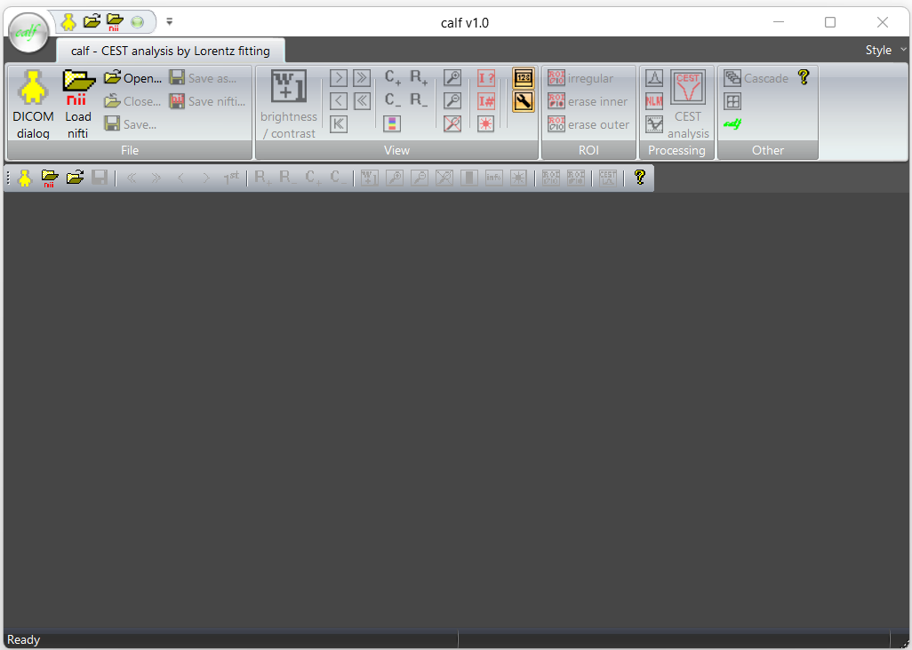
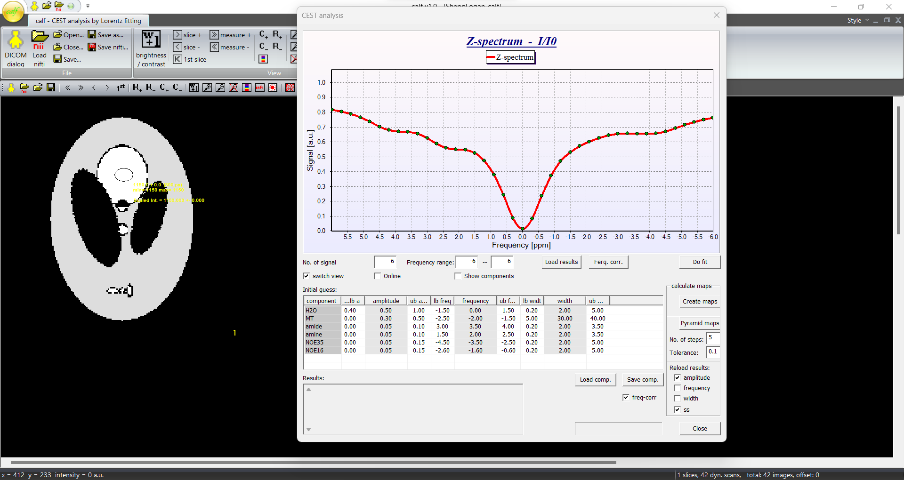

# calf &nbsp;&nbsp;&nbsp;    

*calf* - <ins>**C**</ins>EST <ins>**a**</ins>nalysis software by <ins>**L**</ins>orentzian <ins>**f**</ins>itting

Welcome to calf, a user-friendly software for the analysis of chemical exchange saturation transfer (CEST) MRI data running on Windows 10/11. calf is developed in VC++ 2022 using MFC as graphical user interface. calf uses the control panels common in Windows, so that users can easily find their way around.

## Features
**calf** has several features that make it a useful tool for CEST MRI data analysis. Some of these features include:

- Lorentzian fitting algorithm
- Graphical display of CEST spectra
- Intuitive graphical user interface
- Support for Windows 10/11

## Getting Started

**Note:** To open the help file, right-click on the calf.chm file, select Properties and then Unblock. (This is because Windows may block files downloaded with active fields).

To get started with calf, please follow these steps:

1. Download the latest release, zip file or the full repository of calf from the GitHub repository.
2. Unzip the downloaded file.
3. Open the unzipped calf folder and double-click on calf.exe to start the software.

4. Once you have launched calf, you can open the provided CEST data in the test_data folder by clicking on the "Load Nifti" button.
5. To perform a CEST analysis, click on the "CEST Analysis" button. This will initiate the Lorentzian fitting algorithm to fit the CEST spectrum of each pixel, and generate CEST maps.

6. Now you can customize the parameters of the Lorentzian fitting and calculate CEST maps

## Usage and Citation
If you use calf in your research or work, please cite our paper. For any questions or issues, please feel free to open an issue on the GitHub repository.

Paper: <https://link.springer.com/article/10.1007/s10916-023-01931-6>

doi: <https://doi.org/10.1007/s10916-023-01931-6>

## License
calf is distributed under the MIT License. See the [LICENSE](LICENSE) file for more information.
